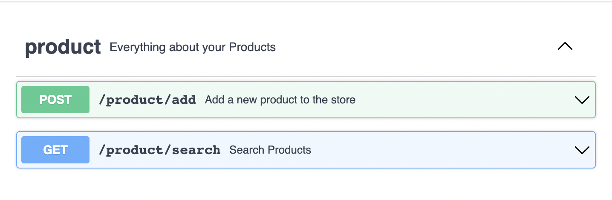

# EFFECTFUL-SEARCH-SERVICE

<p style="text-align:center">
     
    
    
</p>
<br> 

This project is an example application to demonstrate Cats-Effect integration with Elasticsearch.
For the code base, The Shopping Cart application which developed by [Gabriel Volpe](https://github.com/gvolpe) was used.

_________________

## Installation

- Clone the repository and run the following command:

``` bash
git clone https://github.com/dagdelenmustafa/effectful-search-service.git
```

- Inside the root directory, run the following command:

``` bash
docker-compose up
```

- When you run the applicaiton with docker compose it's automatically creates the related mapping in the elasticsearch.

## Usage

- Http interface only expose two endpoints: 



- Product add endpoint requires the following data model in order to create a new product:
- ```
  {
    "product_id": "string",
    "product_url": "string",
    "title": "string",
    "categories": [
      "string"
    ],
    "color": "string",
    "detail_pane": "string",
    "images": [
      "string"
    ],
    "price": "string",
    "price_in_basket": "string",
    "price_new": "string",
    "price_old": "string"
  }
  ```


